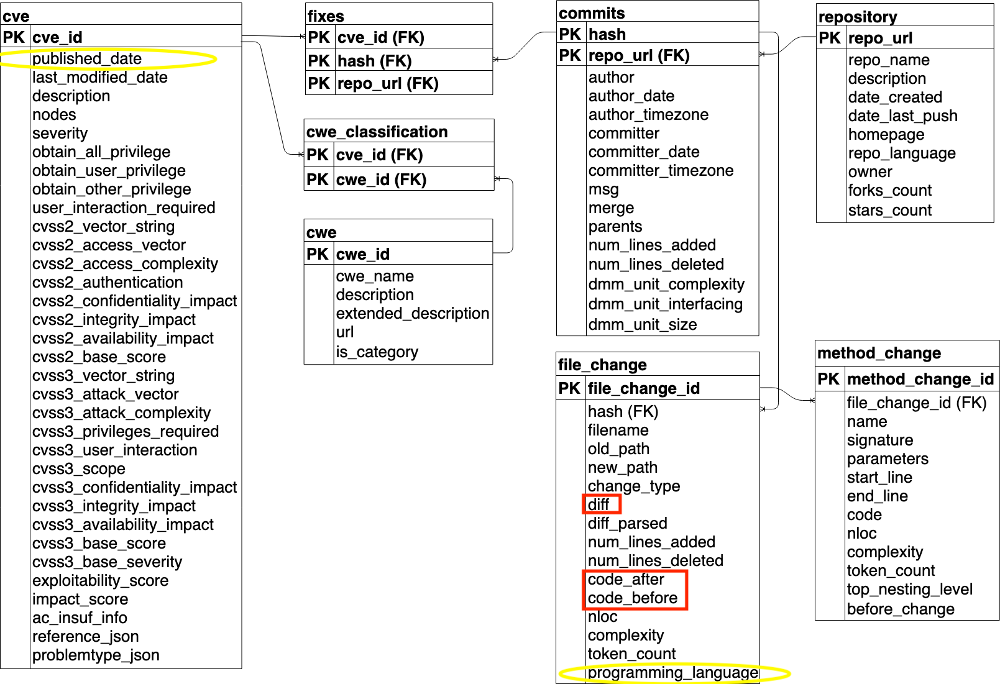
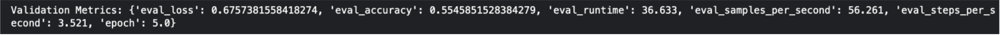
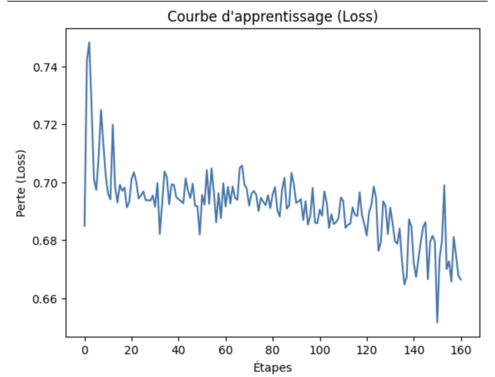
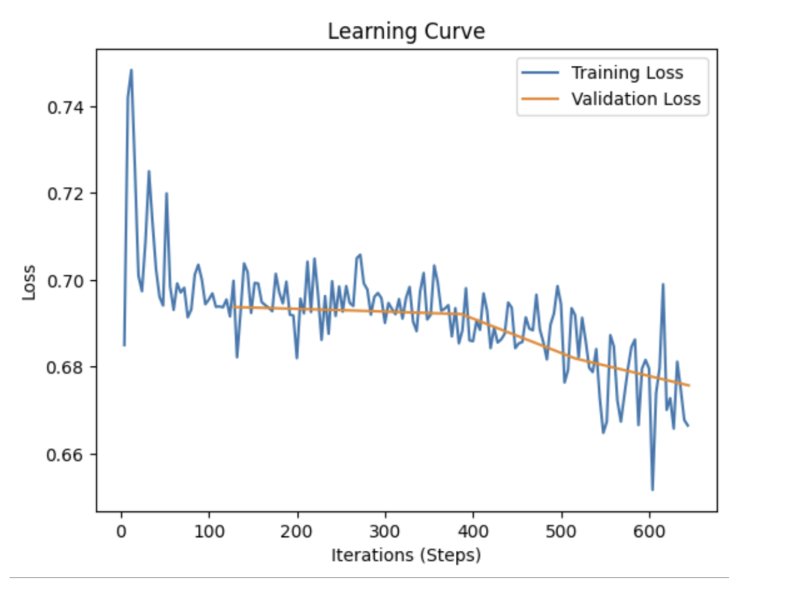
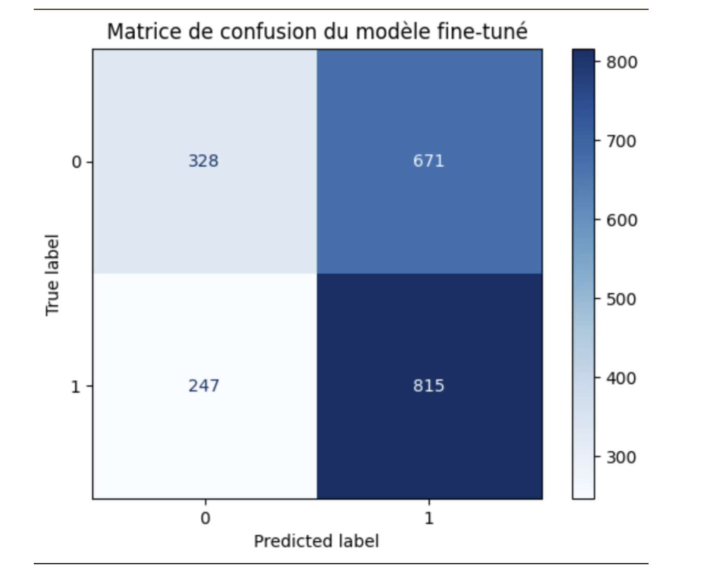

---
title: "CYB6043 - Atelier pratique en cybersécurité"
subtitle: "Entrainement de modèles à partir de la base de données CVE fixes pour détecter du code vulnérable"
author: [BERIOT Ehouarn, BILLY Théo, LEROY Jules, PUECH Émilien, YAKOVLEV Mikhael]
date: \today
keywords: [IA]
lang: "fr"
titlepage: true
titlepage-logo: "./assets/uqo.png"
toc: true
toc-own-page: true
...

# Introduction
## Contexte et enjeux
Dans le monde du développement de logiciels, et plus particulièrement les logiciels open-source, la détection proactive des vulnérabilités dans les codes source est devenue une priorité pour renforcer la sécurité du code. Avec l’augmentation exponentielle des vulnérabilités répertoriées, des solutions basées sur l’intelligence artificielle (IA) se révèlent être des réponses efficaces pour automatiser cette tâche complexe. Les vulnérabilités logicielles ont des impacts considérables, non seulement sur la sécurité des systèmes, mais aussi sur l’intégrité, la confidentialité, la disponibilité des données et la confiance des utilisateurs. Face à cela, il est crucial de détecter et de corriger rapidement les failles avant qu’elles ne soient exploitées.  

## Objectifs du projet
Afin de répondre à ce défi, nous avons décidé d’entraîner un modèle d’IA en utilisant le jeu de données CVE fixes, qui contient des informations détaillées sur les vulnérabilités logicielles et leurs correctifs. Ce jeu de données nous offre une base solide pour entraîner un modèle en analysant les différences entre les versions avant et après correction. 

# CVE fixes
## Origine et pertinence des données 
Le jeu de données CVE fixes provient de la base Common Vulnerabilities and Exposures (CVE), une source standardisée et fiable qui garantit que les données sont bien documentées et représentent les vulnérabilités les plus récentes et pertinentes. En plus de fournir des informations sur les failles de sécurité, le jeu de données offre également e code avant et après correction, avec une colonne diff qui met en évidence les différences spécifiques entre ces versions. Ici un réseau de neurones va pouvoir faire un apprentissage de notre jeu de données pour classifier une nouvelle donnée et détecter des vulnérabilités dans un code.  

## Structure et spécificité du jeu de donnée
La base de données CVE fixes pèse environ 60 Go (format sqlite) et regroupe un grand nombre d'exemples. Elle récolte des informations directement depuis la National Vulnerability Database (NVD), jusqu'à une date donnée (celle-ci est mise à jour plutôt régulièrement). En outre, les auteurs du jeu de données ont mis à disposition un script permettant de mettre à jour la base de données avec les nouvelles CVE, garantissant ainsi une actualisation continue des données. Par exemple, la dernière CVE a été publiée le **22 juillet 2024**. Jusqu'à cette date, la base répertorie **12 923 fixes**, fournissant une couverture exhaustive des vulnérabilités logicielles récentes.

## Structure des données 
Le jeu de donnée est structuré avec plusieurs colonnes clés, telles que ``code_before``, ``code_after``, et ``diff`` dans la table ``file_change``.  
- ``code_before`` contient le code supposé vulnérable avant correction.   
- ``code_after`` contient le code après correction.  
- ``diff`` représente les différences entre les deux versions, c’est-à-dire les lignes modifiées ou ajoutées pour corriger la vulnérabilité (au format git).  

Ces informations sont essentielles pour l’entraînement du modèle d'IA, qui devra apprendre à identifier des motifs récurrents dans les modifications apportées au code afin de détecter des vulnérabilités similaires dans des applications nouvelles.  

Voici la structure de la base données CVE fixes fournie par les développeurs du projet :  
  

# Prétraitemment des données 
## Objectifs du prétraitemment
L’objectif principal de cette étape est d’extraire, de filtrer et de transformer les données issues de la base de données fournie afin de de créer un fichier CSV prêt à être utilisé par la suite pour l’entraînement de notre modèle.  

## Étapes du prétraitement 
### Lecture du fichier de base de données
La première étape consiste à ouvrir le fichier de base de données SQLite contenant les informations sur les vulnérabilités et leurs correctifs. Cela permet d'exécuter des requêtes SQL pour extraire les données nécessaires. 

```python
import config
import sqlite3

db_path = 'config.DB_PATH' # Variable configurable dans un fichier de configuration
conn = sqlite3.connect(db_path)
cursor = conn.cursor()
```

### Filtrage des CVE récentes 
Pour garantir que les données utilisées soient actuelles et pertinentes, seules les CVE publiées au cours des trois dernières années sont extraites. La date limite est calculée dynamiquement en fonction de la date actuelle.

```python
from datetime import datetime, timedelta

date_limite = datetime.now() - timedelta(days=3*365)
date_limite_str = date_limite.strftime('%Y-%m-%d')
print(f"[INFO] Extraction des CVE publiés après le {date_limite_str}")
```

### Requête SQL pour extraire le code 
Deux requêtes SQL distinctes sont utilisées pour récupérer :  
- Les codes corrigés (``code_after``) avec le label ``0``.  
- Les codes vulnérables (``code_before``) avec le label ``1``.  

Ces requêtes incluent des conditions pour : 
- Ne sélectionner que les fichiers en PHP. 
- Exclure les enregistrements sans code avant correction. 

```python
query = f"""
SELECT 
    file_change.code_after code,
    file_change.diff,
    file_change_id,
    '0' label
FROM cve
JOIN fixes ON cve.cve_id = fixes.cve_id
JOIN commits ON fixes.hash = commits.hash
JOIN file_change ON commits.hash = file_change.hash
WHERE cve.published_date >= '{date_limite_str}'
    AND file_change.programming_language = 'PHP'
    AND file_change.code_before IS NOT "None"
ORDER BY cve.published_date DESC;
"""

query2 = f"""
SELECT 
    file_change.code_before code,
    file_change.diff,
    file_change_id,
    '1' label
FROM cve
JOIN fixes ON cve.cve_id = fixes.cve_id
JOIN commits ON fixes.hash = commits.hash
JOIN file_change ON commits.hash = file_change.hash
WHERE cve.published_date >= '{date_limite_str}'
    AND file_change.programming_language = 'PHP'
    AND file_change.code_before IS NOT "None"
ORDER BY cve.published_date DESC;
"""
```

### Filtrage des données par taille des tokens 
Étant donné que nous utilisons le tokenizer ``microsoft/codebert-base`` nous devons respecter une contrainte qui est de ne pas dépasser **512 tokens** une fois le code tokenizer. Chaque entrée est donc analysée pour extraire les modifications spécifiques (diff) et s'assurer que le nombre total de tokens générés ne dépasse pas 512. Si une entrée dépasse cette limite, elle est supprimée.  
Étapes :  
- Identifier les plages de lignes affectées (``start_line``, ``end_line``) à partir du diff.  
- Calculer le nombre de tokens dans les modifications.  
- Si le total dépasse 512 tokens, ignorer l'entrée.  
- Ajouter un contexte avant et après les modifications pour maximiser l’information.  

```python
# Parcours des lignes du DataFrame
for n, row in combined_df.iterrows():
    if n % 100 == 0:
        print(f"[INFO] Traitement de l'entrée {n}/{len(combined_df)}")

    try:
        code = row['code']
        diff = row['diff']
        label = row['label']

        # Identifier les plages de lignes affectées
        if label == '1':  # Code vulnérable
            range_info = diff.split(' ')[1]
        elif label == '0':  # Code corrigé
            range_info = diff.split(' ')[2]
        else:
            print(f"[WARNING] Label inconnu pour l'entrée {n}. Ignorée.")
            to_remove.append(n)
            continue

        if ',' in range_info:
            start_line, nb_lines = map(int, range_info.split(','))
        else:
            start_line = int(range_info)
            nb_lines = 1

        # Extraction des tokens de `diff` et calcul du nombre total de tokens
        start_line = abs(start_line)
        end_line = start_line + nb_lines
        splitted_code = code.split("\n")
        code_in_diff = "\n".join(splitted_code[start_line:end_line])
        code_in_diff_tokenized = tokenizer.tokenize(code_in_diff)
        diff_token_count = len(code_in_diff_tokenized)

        # Si le diff dépasse 512 tokens, supprimer cette entrée
        if diff_token_count > 512:
            print(f"[INFO] Entrée {n} : Diff trop long ({diff_token_count} tokens). Ignorée.")
            to_remove.append(n)
            continue

        # Calculer le contexte en fonction des tokens restants
        remaining_tokens = 512 - diff_token_count
        context_tokens = remaining_tokens // 2  # Égalité avant et après

        # Tokenisation complète du code pour manipuler les tokens
        splitted_code_tokenized = tokenizer.tokenize("\n".join(splitted_code))

        # Identifier les indices des tokens
        start_token_index = len(tokenizer.tokenize("\n".join(splitted_code[:start_line])))
        end_token_index = start_token_index + diff_token_count

        # Calcul des indices pour le contexte
        start_context_index = max(0, start_token_index - context_tokens)
        end_context_index = min(len(splitted_code_tokenized), end_token_index + context_tokens)

        # Extraction des tokens avant, dans et après le diff
        context_before_tokens = splitted_code_tokenized[start_context_index:start_token_index]
        context_after_tokens = splitted_code_tokenized[end_token_index:end_context_index]

        # Reconstruction des tokens finaux
        final_code_tokens = context_before_tokens + splitted_code_tokenized[start_token_index:end_token_index] + context_after_tokens

        # Conversion des tokens en texte
        final_code = tokenizer.convert_tokens_to_string(final_code_tokens)
        combined_df.at[n, 'code'] = final_code

    except Exception as e:
        print(f"[ERROR] Erreur lors du traitement de l'entrée {n} : {e}")
        to_remove.append(n)
```

## Résultats du prétraitement 
Statistiques des données prétraitées :  
- Nombre total d’instances initiales : 125572    
- Nombre final d’instance dans notre jeu de données : à 10285  

### Exemple de données
```bash
head path_to_csv_file

                                                code  label
0                  }\n                }\n\n      ...      0
1       }\n        }\n        return $output;\n  ...      0
2  <?php\n\nnamespace SilverStripe\Reports\Tests;...      0
3  <?php\n\nnamespace SilverStripe\Reports\Tests\...      0
4  int with deprecated class Webauthn\\\\PublicKe...      0
```

# Entrainement du modèle
## Outils 
### Github
Pour le projet, nous avons créer un dépôt github, celui-ci contient :  
- Le script de prétraitement complet  
- Un script de validation des données (vérification de la longueur du code une fois tokenizer avec codebert-base)  
- Notre jeu de donnée (fichier csv)  
- Une sauvegarde du notebook jupyter pour entraîner notre modèle  

La technologie git permet de créer un environemment collaboratif très simplement et de garder un versioning. C'est un outil indispensable pour les projets de groupe qui contiennent du code comme le notre. 

### Kaggle
Kaggle nous a permis d’exécuter notre notebook d’entraînement en utilisant des ressources plus importantes que nos machines locales. Cet outil propose également une fonctionnalité de sauvegarde des différentes versions d’un notebook, et d’importer des jeux de données de manière persistante.  
L’utilisation d’un notebook par opposition à un script entier permet d’isoler chaque étape de l’entraînement et de les lancer indépendamment.  

### Hugging-Face
Hugging Face propose une multitude de modèles préentraînés. Nous avons d’abord utilsé le modèle “bert-base-cased", spécialisé dans le Natural Language Processing, puis nous avons évolué vers le modèle “codebert-base”, spécialisé dans le traitement de code.  

Le modèle est importé en quelques lignes dans notre notebook d’entraînement. 

```python
from transformers import AutoTokenizer
tokenizer = AutoTokenizer.from_pretrained('bert-base-cased')
```

## Entrainement
Nous avons fine-tuné notre modèle dans notre notebook. Celui-ci est organisé en bloc.

### Importation des modules

```python
import numpy as np
import pandas as pd
import os
import matplotlib.pyplot as plt


from sklearn.model_selection import train_test_split
from transformers import RobertaTokenizer, RobertaConfig, RobertaModel, pipeline
from datasets import Dataset
from transformers import AutoModelForSequenceClassification, Trainer, TrainingArguments, AutoTokenizer
from sklearn.metrics import accuracy_score, confusion_matrix, ConfusionMatrixDisplay, precision_score
```

### Lecture du jeu de donnée et vérification du contenu 

```python
data = pd.read_csv('/kaggle/input/cvefixes-php-under-512-token/cvefixes_diff_under_512_centered_v3.csv')
data.head()
data.count()
```

### Séparation des données de test et d'entrainement 

```python
X = data['code']
Y = data['label']

# X, Y

X_train, X_test, Y_train, Y_test = train_test_split(X, Y, test_size=0.2, shuffle=True, random_state=0)
```

### Tokenization
C’est à cette étape que nous commençons à utiliser le modèle “microsoft/codebert-base”. Le nombre maximum de tokens (512) demandé par BERT est bien spécifié, pour lever un avertissement en cas de données non valide.  

```python
tokenizer = RobertaTokenizer.from_pretrained("microsoft/codebert-base")

train_data = Dataset.from_dict({"code": X_train, "label": Y_train})
test_data = Dataset.from_dict({"code": X_test, "label": Y_test})

def preprocess_function(examples):
    return tokenizer(
        examples['code'],
        truncation=True,
        padding='max_length',
        max_length=512
    )

tokenized_datasets = {
    "train": train_data.map(preprocess_function, batched=True, batch_size=32, load_from_cache_file=False),
    "validation": test_data.map(preprocess_function, batched=True, batch_size=32, load_from_cache_file=False)
}
```

### Fine tuning du modèle
C’est ici que commence le fine-tuning du modèle pré-entraîné. La variable ``training_args`` contient les hyperparamètres. Nous avons testé plusieurs combinaisons de paramètres différentes en cherchant à optimiser le modèle. 

```python
model = AutoModelForSequenceClassification.from_pretrained("microsoft/codebert-base", num_labels=2)

training_args = TrainingArguments(
    per_device_train_batch_size=32, # 16 ok, 32 ça passe
    learning_rate=2e-5, # valeur à tester
    warmup_ratio=0.1, # valeur à tester
    weight_decay=0.1, # pour régulariser le modèle et d'éviter l'overfitting
    output_dir="./results",
    evaluation_strategy="epoch", # epoch vs steps
    save_strategy="epoch", # epoch vs steps
    report_to="none",
    logging_steps=4,
    num_train_epochs=5,
    logging_dir="./logs"
)

def compute_metrics(eval_pred):
    logits, labels = eval_pred
    predictions = np.argmax(logits, axis=-1)
    accuracy = accuracy_score(labels, predictions)
    return {"accuracy": accuracy}

trainer = Trainer(
    model=model,
    args=training_args,
    train_dataset=tokenized_datasets["train"],
    eval_dataset=tokenized_datasets["validation"],
    compute_metrics=compute_metrics
)

trainer.train()
```

# Résultats et analyses
Une fois notre modèle fine-tuner nous devons évaluer ces performances et comprendre quels paramètres modifier pour optimiser ces performances, et faire ce processus de manière itératif.  

Le modèle que nous évaluons ci-dessous est le modèles codebert-base de Microsoft qui est fine-tuner avec notre jeu de données spécifique au code php de moins de 3 ans, sur les données spécifiques aux modifications avec moins de 512 tokens. Nous l’avons fine-tuner avec seulement 5 epoch, ce qui qui est trop peu mais par manque de temps et de ressource matérielle nous n'avons pas peu malheureusement aller plus loin.  

Pour évaluer notre modèle, nous avons utilisé :  
- Un **test de précision** : il mesure la capacité du modèle à éviter les faux positifs dans les prédictions de vulnérabilités. En termes techniques, la précision est le rapport entre les vrais positifs et la somme des vrais positifs et des faux positifs. Une précision proche de 1 indique que le modèle est très précis, tandis qu’une précision de 0,5 signifie une performance médiocre, équivalente à une classification aléatoire (pile ou face).  

  

Le test de précision révèle que notre modèle atteint une précision de 0.55, ce qui est légèrement au-dessus d’une classification aléatoire (0.5). Cela indique que le modèle est capable de prédire correctement certaines vulnérabilités, mais il génère encore un nombre significatif de faux positifs. Cette précision pourrait être améliorée en augmentant le nombre d’époques ou en diversifiant le jeu de données d’entraînement.

- La **courbe d’apprentissage** : Elle permet de visualiser la perte (loss) du modèle au fil des étapes d’entraînement. Elle permet de détecter des problèmes comme un surapprentissage (overfitting) ou un sous-apprentissage (underfitting). Une courbe stable et décroissante indique que le modèle apprend efficacement.  

  
  

- Visualiser matrice de confusion : La matrice de confusion est un outil visuel permettant d’évaluer les performances de classification du modèle en comparant les prédictions avec les vraies étiquettes. Elle est composée de quatre éléments principaux:    
    - **Vrais positifs (TP)** : cas où le modèle a correctement prédit une vulnérabilité.  
    - **Faux positifs (FP)** : cas où le modèle a prédit une vulnérabilité inexistante.  
    - **Vrais négatifs (TN)** : cas où le modèle a correctement prédit qu'il n'y avait pas de vulnérabilité.  
    - **Faux négatifs (FN)** : cas où le modèle a manqué une vulnérabilité réelle.  

En visualisant la matrice de confusion, nous pouvons identifier les biais du modèle, comme une tendance à surestimer ou sous-estimer les vulnérabilités. Cet outil est essentiel pour comprendre où se situent les erreurs du modèle et ainsi orienter les ajustements nécessaires pour améliorer ses performances.  

  

La matrice de confusion met en évidence les erreurs du modèle avec une précision de 0.55. Le modèle nous donne un nombre de faux positifs (**FP**) élevé par rapport aux vrais positifs (**TP**). Cela indique une tendance du modèle à signaler des vulnérabilités inexistantes.  

Ce comportement pourrait être corrigé en équilibrant le jeu de données ou en introduisant des techniques comme la régularisation ou le fine-tuning avec un jeu de validation mieux adapté. De plus, un nombre élevé de faux négatifs (**FN**) compromettrait la capacité du modèle à détecter les vulnérabilités réelles, ce qui nécessiterait une amélioration du rappel.  

Bien que ces conclusions soient pertinentes elles ne sont pas forcément correctes car le modèle n’a pas été assez fine tuner, 5 époques n’est pas suffisent.  

Une fois que nous avons compris les résultats de notre modèle, nous devons le réentraîner en optimisant les hyperparamètres pour avoir des résultats satisfaisant, c’est un processus itératif.  

Afin d’optimiser le fine-tuning de notre modèle, nous pouvons modifier les hyperparamètres, qui sont les paramètres d’apprentissage de notre modèle, voici les différents paramètres :  
- ``per_device_train_batch_size`` : Taille du batch, c’est-à-dire le nombre d’échantillons traités simultanément par le modèle à chaque étape d’entraînement. Une valeur plus élevée peut accélérer l’entraînement, mais nécessite plus de mémoire.  
- ``num_train_epochs`` : Nombre d’époques, soit le nombre de fois que le modèle parcourt l’intégralité des données d’entraînement, ce paramètre à un impact important sur le temps d’apprentissage.  
- ``learning_rate`` : Taux d’apprentissage, qui contrôle la vitesse à laquelle le modèle ajuste ses paramètres pendant l’entraînement. Une valeur trop élevée peut empêcher la convergence, tandis qu’une valeur trop faible ralentit l’apprentissage.  


# Perspectives
## Modèle
Dans notre projet nous nous sommes concentrés sur le modèle pré-entrainé codebert-base, il serait intéressant de comparrer nos résultats avec d'autres modèles pré-entrainé comme [code T5](https://github.com/salesforce/CodeT5). 

## Fine-Tuning
Étant donné que nos données sont plutôt conséquentes (beaucoup de ligne de code), nous avons entrainé notre modèle avec des réglages précis, que nous comparons dans la partie précèdente. Nous pouvons imaginer beaucoup plus de test avec des régalges différent pour évaluer lesquels sont les plus optimisés. 

## Jeu de données
En effet, nous avons choisi le jeu de données CVE fixes, mais nous avons pris qu'une seule partie de celle-ci, bien que le langage PHP représente un gros pourcentage dans la base de donnée CVE fixes, nous pouvons imaginer que nous ne nous limitons pas à un seul langage de programmation. 

# Sources